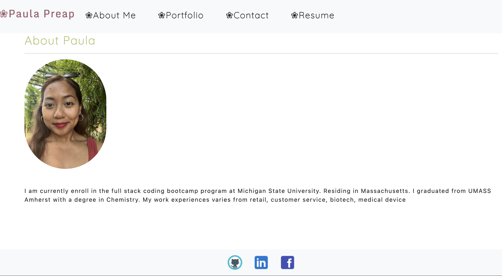

# Module 20 Challenge: React Portfolio
   

  Link to Application:(https://pppreap.github.io/pp_react_portfolio/
)

Link to Github Repository:(https://github.com/pppreap/pp_react_portfolio)

## Description

Using React.js, npm, bootstrap, and github pages, a portfolio page is created to share your projects and resume to fellow developers and future employers.

## Installation
install
- npm i react bootstrap, ghpages
- npx create-react-app 
- npm init
- npm start
- npm run build
- npm run deploy

## Usage
Create a display page for your projects to share with others

User Story from Module 20 Challenge

AS AN employer looking for candidates with experience building single-page applications
I WANT to view a potential employee's deployed React portfolio of work samples
SO THAT I can assess whether they're a good candidate for an open position

## Acceptance Criteria
GIVEN a single-page application portfolio for a web developer

WHEN I load the portfolio
THEN I am presented with a page containing a header, a section for content, and a footer

WHEN I view the header
THEN I am presented with the developer's name and navigation with titles corresponding to different sections of the portfolio

WHEN I view the navigation titles
THEN I am presented with the titles About Me, Portfolio, Contact, and Resume, and the title corresponding to the current section is highlighted

WHEN I click on a navigation title
THEN I am presented with the corresponding section below the navigation without the page reloading and that title is highlighted

WHEN I load the portfolio the first time
THEN the About Me title and section are selected by default

WHEN I am presented with the About Me section
THEN I see a recent photo or avatar of the developer and a short bio about them

WHEN I am presented with the Portfolio section
THEN I see titled images of six of the developer’s applications with links to both the deployed applications and the corresponding GitHub repository

WHEN I am presented with the Contact section
THEN I see a contact form with fields for a name, an email address, and a message

WHEN I move my cursor out of one of the form fields without entering text
THEN I receive a notification that this field is required

WHEN I enter text into the email address field
THEN I receive a notification if I have entered an invalid email address

WHEN I am presented with the Resume section
THEN I see a link to a downloadable resume and a list of the developer’s proficiencies

WHEN I view the footer
THEN I am presented with text or icon links to the developer’s GitHub and LinkedIn profiles, and their profile on a third platform (Stack Overflow, Twitter) 

## Assets

## Contributions/Licenses/Links
https://pppreap.github.io/pp_react_portfolio/

https://github.com/pppreap/pp_react_portfolio

## Licenses

 
This application is covered by the MIT license. 

## Credits
MSU Bootcamp 2022.

## Tests
testing-library/jest-dom

## Table of Contents 

- [Description](#description)
- [Installation](#installation)
- [Usage](#usage)
- [Credits](#credits)
- [License](#license)
- [Contributions](#contributions)
- [Questions](#questions)

## Badges

## Questions
Any question Contact Me : 
Github Username: https://github.com/pppreap  
Contact Email: pppreap@gmail.com
